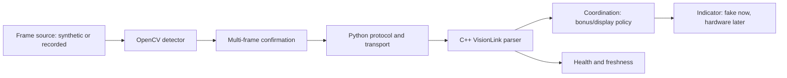

# Robot handover plan — local ArUco first

Status: **APPROVED ROADMAP — Phase 0 implemented; review pending.** Each later
phase still requires the team's approval after the preceding phase report.

Audit date: October 5, 2026. Tournament: **October 17, 2026**.
Baseline commit: `9f96c31` on `main`; the working tree was clean before this
document. No implementation, branch, commit, push, or PR was made during planning.

The team requested the full roadmap with ArUco early. No hardware is connected;
the first vision deliverable must work entirely on a computer. Raspberry Pi,
camera, display, motor, and sensor selections and connections remain unverified.
The audience is students in their first three semesters: simple algorithms,
small modules, reproducible tests, and explanations suitable for a mentor.

### Phase 0 delivery record

Branch: `phase/0-hygiene`. The firmware now links with an inert entry point and
explicitly compiles the production libraries. Native test support is isolated;
existing maze behavior is unchanged. Configuration, CI, ignore rules, module
notes, and unresolved hardware/rules questions are documented in this phase.

| Check | Phase 0 result |
|---|---|
| `pio test -e native` | 39/39 passed; zero compiler warnings |
| `pio run -e esp32` | Successful build/link; zero compiler warnings |
| Target dependency graph and map | Production types/grid/IO/maze present; no fake robot or maze generator |
| `pio run -e bench` and benchmark | 10,000 rows exactly match the baseline commit's output; zero compiler warnings |
| CI workflow checks | Push/PR jobs parsed; command failures and warning diagnostics correctly fail each job |
| Documentation/working tree checks | Relative links resolve; `git diff --check` passes; generated CSV retained locally but untracked |

**UNVERIFIED ON HARDWARE:** startup, physical board identity, wiring, motion,
sensors, camera, UART, and display. Phase 5A local ArUco is next and is not part
of the Phase 0 implementation. Hosted CI results are recorded on the phase PR.

## 1. Baseline and audit

### Sources read

- The team's handover requirements, architecture invariants, and quality gates.
  Engineering conventions belong in the architecture and module documentation.
- `README.md`, every existing document in `docs/`, the architecture SVG including
  its embedded diagram, and all 19 PDF pages and relevant figures in
  `docs/rules/Reto Candidates Principiantes 2026.pdf` (August 28, 2026 revision).
- Every project source/manifest under `firmware/lib`, `firmware/test`,
  `firmware/bench`, `vision`, and `tools`. The Python lockfile was inspected;
  all 7,500 rows of the existing CSV were parsed. Generated virtual-environment
  dependencies and build products are not project source.
- `firmware/platformio.ini`, the empty entry point, ignore rules, tracked-file
  inventory, and git history back to the initial architecture and maze changes.

### Exact test and build results

The shell initially could not find `pio`: both requested commands exited **127**
with `/bin/bash: line 1: pio: command not found`. PlatformIO exists at
`/home/daniel-diaz-de-leon/.platformio/penv/bin/pio`. The first native retry was
blocked by read-only access to `~/.platformio/platforms.lock`; it was rerun with
approved cache access. These environment failures are separate from code results.

Commands below ran from `firmware/` using that installed executable:

| Command | Result | Exact summary |
|---|---|---|
| `pio test -e native` | Exit 0; no warnings reported | `39 test cases: 39 succeeded in 00:00:03.438` |
| `pio run -e esp32` | **Exit 1** | `esp32 FAILED 00:00:03.156`; undefined references to `setup()` and `loop()`; `collect2: error: ld returned 1 exit status` |
| `pio run -e bench` | Exit 0; no warnings reported | `bench SUCCESS 00:00:01.807` |
| `.pio/build/bench/program` | Exit 0; empty stderr | 10,000 data rows, four strategies, 500 seeds × five loop counts each |

Native suites: grid **10**, robot IO **4**, path planner **11**, strategies **8**,
maze generator **6**. All passed. The ESP32 environment selects Espressif32 6.9.0,
Arduino framework package 3.20017.241212, and `esp32-s3-devkitc-1`. This is a build
configuration, not confirmation of the team's physical board. Its dependency
scan currently says **“No dependencies”**, so it does not validate the maze
libraries for the target. A zero-warning, successful ESP32 build is not established.

Additional dependency-only check: the existing `vision/.venv` has Python 3.14.3,
OpenCV 5.0.0, and NumPy 2.5.3. OpenCV decoded **200/200** clean synthetic cases
(IDs 0–49 at four quarter-turn rotations). This was a temporary audit probe,
**not an implemented application test suite** or a camera-performance result.
The computer's system Python instead provides OpenCV 4.6.0.

Fresh benchmark results, using the existing uncalibrated motion costs:

| Strategy | Runs | Reached red | Mean time, ms | Mean cells visited |
|---|---:|---:|---:|---:|
| Wall follower | 2,500 | 2,500 | 124,586.2 | 19.958 |
| DFS NESW | 2,500 | 2,500 | 200,125.4 | 23.620 |
| DFS straight first | 2,500 | 2,500 | 195,755.8 | 23.620 |
| Frontier BFS | 2,500 | 2,500 | 125,000.6 | 23.620 |

All strategies had zero blocked moves, strategy errors, and timeout flags in this
run. Cells behind red may be inaccessible before finishing; 25 visited cells is
not always possible. These numbers do not include terrain, vision, return trips,
physical display timing, or measured drivetrain costs, and are not score estimates.

### What exists

**Implemented and exercised:** shared types, edge-indexed grid, `IRobotIO`, maze
`FakeRobotIO`, runner, wall follower, both DFS variants, frontier BFS, BFS path
planning, generator/validator, five native test suites, and benchmark executable.
Belief and truth are separate. Strategies do not include Arduino headers.

**Empty:** `firmware/src/main.cpp`; `levels/ColorPath.hpp`; all planned hardware,
coordination, persistence, safety, and vision-link modules; all four vision Python
entry/module files; both tool scripts; `docs/states.md`, `docs/uart.md`,
`docs/pinout.md`, and all four existing `docs/classes/*.md`. ADR, calibration, and
systemd directories contain placeholders only.

**Missing:** CI, `firmware/include/config.h`, bring-up programs/environments,
`docs/OPEN_QUESTIONS.md`, onboarding, and benchmark report. The vision manifest
and lockfile exist, but no vision tests do.

### Inconsistencies and concrete gaps

| Finding | Resolution / owner |
|---|---|
| README describes `main.cpp` as creating tasks, but it is empty and the ESP32 link fails. | Phase 0: accurate status plus inert Arduino entry point; Phase 4: actual task wiring. |
| A passing ESP32 command would not currently compile the production strategy libraries. Test doubles share the `robot_io` library, and test-only exclusions are not explicit. | Phase 0: explicit production build coverage, separate native-only fake library, and exclusions/map inspection for ESP32. |
| All class docs, ADRs, UART, states, and pinout pages are empty despite being linked as useful references. | Phase 0: document conventions/status and list gaps; each phase documents its additions; Phase 6 completes legacy handover. |
| “Red ends the round” omits the rulebook's explicit Bonus 1 exception. | Phase 0: correct wording; Phase 1: a distinct optional return state after reaching red. Exploration still never enters red. |
| The boundary-left placement and start/red-corner assumptions are team conventions, not clearly guaranteed by the rulebook text. Figures are examples and positions may vary. | Preserve current assumptions and tests; document their source and seek confirmation before tournament use. |
| `RunResult` has no colors, points, terrain completions, ArUco display completion, or return result. `showColor()` has no evidence of physical display completion. | Phases 1 and 5A: explicit scoring/display events; simulations must not award unobserved points. |
| The deadline is a fixed 60-second reserve, not an estimate of finish/return costs. `timedOut` also means entering that reserve; finishing can begin an action with insufficient time. | Phase 1: route/time estimates and distinct stop reasons. Phase 3 supplies the actual round clock. |
| The move log silently stops at 256 entries while each runner loop permits 500 attempts. Exact replay is therefore not guaranteed. | Phase 1: bounded complete outbound log, explicit capacity handling, and no return eligibility after a gap. |
| `run()` resets the nominal start but not the belief, log, finishing flag, or strategy state. Action/sensor failure paths are not covered by the current happy-path tests. | Phase 1: explicit fresh-run/reset lifecycle and failure tests; Phase 3 restores only supported checkpoint state. |
| DFS updates its stack when requesting a move and repairs it on a later call. The literal claim that its top *always* equals the real cell is stronger than the implementation/tests. | Phase 1: report movement outcomes explicitly so stack commits follow successful moves; test failure and red-refusal cases. |
| `findFinishTarget()` says “nearest” unseen corner but uses fixed corner order. An unknown current-tile reading is only sampled on first visit and never retried there. | Phase 1: measured route selection and retryable color observation. |
| Cell size and deadline/simulation cost defaults are scattered; `Terrain.hpp` uses `<stdint.h>` with `std::uint8_t`. | Phase 0: portable include, remove unused per-cell size field, central configuration and named simulation defaults. Do not present simulated times as measurements. |
| Generator produces colored, flat mazes only. Its validator checks connectivity through red, not full exploration without red, and checks inward heading without independently enforcing boundary-left placement. High `extraOpenings` values are narrowed to signed 8-bit before clamping. | Phase 0: describe limits; Phase 1: independent validation/bounds tests and optional terrain fixtures; keep accessible-before-red coverage as the strategy contract. |
| `tools/results.csv` is tracked, is stale (three strategies/7,500 rows), and has no points. `.gitignore` accidentally joins `__pycache__/tools/results.csv` and repeats archive patterns. | Phase 0: repair ignore rules and untrack generated CSV without deleting the local copy. Phase 1: regenerate ignored results and commit only report artifacts. |
| README describes vision and reporting tools by purpose without marking them empty; telemetry is not identified as development-only. | Phase 0: correct statuses and competition/development distinction. No participant-facing telemetry during a round. |
| Vision README says to use system Python on Pi, while manifest requires Python >=3.14 and NumPy >=2.5.3. Local and system OpenCV APIs differ; Pi compatibility is untested. UART/camera/test dependencies and service are absent. | Phase 5A: lock and test the working local environment. Phase 5B: choose and validate a Pi-specific environment from actual OS/hardware facts. |
| Diagram shows observation/action-status vocabulary and asynchronous subsystem behavior absent from today's blocking `IRobotIO` and runner. | Phase 0: label future design; Phases 1–4: incremental runner and bounded hardware operations behind existing layers, with an ADR. |
| Terrain fields have no sensing/traversal completion model, and line/grip fakes are placeholders (no lines; close always means holding). | Phases 1–2: honest simulation events and a separate Pista B world; Phase 4: real sensing. |
| Persistent maps are shown in the architecture but are not implemented, and pre-mapping is prohibited. A rebooted timer cannot simply restart at six minutes. | Phase 3: conservative persistence policy and an explicit uninterrupted-clock requirement; judge/hardware questions below. |
| Broad descriptions omit Pista B restart ball placement, optional fourth-restart advancement, and continuous-possession bonus wording. | Phases 2–3: implement rule-specific recovery cases, with ambiguous score/skip policy gated by judge clarification. |

No source rewrite is justified merely to change architecture. Preserve the tested
grid, belief/truth separation, BFS, start frame, and downward dependencies.

## 2. Order and shared design

Keep the requested phase numbers for traceability, but split Phase 5:

**0 → 5A (local ArUco) → 1 → 2 → 3 → 4 → 5B (Pi deployment) → 6.**

Reason: ArUco and protocol/display logic can be proved without hardware and are
the team's immediate priority. Waiting until every robot driver exists would
delay discovering vision/integration failures. Phase 5A pulls only the pure
vision-link and display-timing portions of Phase 4 forward. It does not claim
physical integration is finished. Documentation is written in every phase.

The Pi reports observations; it never commands motors. Strategy reaches the world
through `IRobotIO`. Coordination owns track/mode, deadline, and scoring eligibility.
The indicator owns actual visible output. Safety remains the only direct motor
gate outside the ordinary command path. No image buffers or Python code run on ESP32.

Public interface changes will stay small and typed:

- `RunResult`: add `colorsShown`, `points`, return outcome, ArUco display outcome,
  and a reason for ending; maintain the existing metrics for benchmark comparison.
- Runner: explicit initialization/reset, one-step progression, and movement
  outcome notification to strategies. Retain `run()` as the test/benchmark wrapper.
- `IRobotIO`: add only the observations/actions required by scoring and Pista B,
  including display completion, completed terrain traversal, fresh ball
  observation, and bounded short movement for line approach. Update all fakes
  in the same change. No Arduino types cross the interface.
- Pure C++ vision messages/link health and indicator timing policy; injected
  clock/byte transport/display so native tests need no UART or screen.
- Checkpoint state store and round-clock interfaces with in-memory fakes;
  versioned, bounded persistence with validation before restore.

All firmware remains C++17, fixed-size/no heap/no exceptions, with `.cpp` beside
`.hpp` in declared libraries. Every firmware tunable lives in `config.h`.
Unknown pins/measurements use explicit unset values and `TODO(team): confirm`;
bring-up must refuse to energize outputs with unresolved configuration. Python
settings have one `vision/config.py` source; shared protocol constants have
cross-language conformance tests. No generated firmware configuration is required.

## 3. Phases and acceptance gates

### Phase 0 — Hygiene

**Goal:** establish a truthful, reproducible, green baseline before features.
**Size:** small, approximately 0.5–1.5 engineer-days.

**Files:** `.github/workflows/ci.yml`, `.gitignore`, `README.md`,
`firmware/platformio.ini`, `firmware/src/main.cpp`,
`firmware/include/config.h`, affected library manifests/test imports,
`docs/OPEN_QUESTIONS.md`, architecture/status docs, and an ADR for test isolation.

**Changes:** fix the linker with inert `setup()`/`loop()`; compile the actual pure
production libraries in ESP32 builds; separate `FakeRobotIO` into a native-only
library and explicitly exclude test tooling from ESP32. Repair generated-file
tracking and configuration/include hygiene. Reconcile each audit finding in docs,
assigning feature fixes to the phases above rather than pretending they exist.
Preserve the team's engineering conventions in ordinary project documentation.
CI runs both required commands on **every push and pull request**, uses a pinned
PlatformIO version, and caches only reproducible dependencies/build artifacts.

**Tests:** all 39 existing tests; ESP32 link; build dependency/map inspection for
production libraries and absence of test tooling; benchmark still builds/runs.
Inspect warnings in both native and ESP32 logs; do not hide vendor or local warnings.

**Done:** CI definition and local equivalents are green; module statuses and open
questions are accurate; no unconfigured output is enabled. First implementation
commit includes the linker repair so the per-commit build rule can hold.

**Hardware limit:** no claim of booting, wiring, motor safety, or board-model match.

### Phase 5A — Local ArUco and protocol/display proof

**Goal:** demonstrate the complete logical Bonus 2 path on the computer.
**Size:** medium, approximately 2–3 engineer-days.

**Files:** implement `vision/aruco_detector.py`, `vision/serial_link.py`,
`vision/main.py`; add `vision/confirmation.py`, `vision/frame_source.py`,
`vision/config.py`, `vision/tests/`; update Python dependency/lock files and README.
Add pure modules/tests under `firmware/lib/vision_link`, `firmware/lib/indicator`,
and `firmware/test`; shared protocol fixtures under `tests/fixtures/vision/`;
an explicit native demo target under `firmware/bench/vision_demo/`;
`docs/uart.md`, relevant class docs/ADRs, and CI's Python job.

**Detection and confirmation:**

- Use the installed, verified OpenCV `ArucoDetector` API with **DICT_4X4_50**,
  IDs **0–49**. Construct the detector once. Decode grayscale frames and return
  IDs/corners with frame identity and capture time. Marker ID is the deliverable;
  pose estimation, machine learning, and camera calibration are not prerequisites.
  The rulebook's approximate 8 cm size is not an invented distance estimator.
- Frame sources implement one interface. Synthetic sequences and file/video
  replay are required now; webcam preview is optional development functionality.
  CSI/Picamera2 and physical serial are adapters added after hardware selection.
  Never open a camera or serial port on import or in unit tests.
- Start with **three matching observations among the latest five distinct frames,
  within 500 ms**, and no competing ID in that window. Empty frames contribute no
  vote; frames containing multiple different IDs are ambiguous. Stale/out-of-order
  frames cannot vote; one frozen frame cannot confirm itself. These are testable
  software defaults to tune on hardware, not measured camera requirements.
- Reset confirmation on mode/session change, source failure, or expiration. Latch
  the first confirmed ID for the active run; repeated sightings do not overwrite
  it or repeatedly restart the display. Calibration sightings cannot carry into
  a scored run. Record frame age and detection/confirmation latency for local tests.

**Protocol and visible-output contract:**

- `docs/uart.md` is empty today: define a versioned protocol here and implement
  both ends together. Use bounded ASCII records with newline framing and
  CRC-16/CCITT-FALSE, a link session, sequence number, message type, and payload.
  Maximum record length: 96 bytes including newline. Specify exact byte grammar,
  CRC coverage, numeric bounds, and golden examples in the same commit.
- Messages cover controller mode (`OFF`, `ARUCO`; reserve `BALL`), boot/ready,
  heartbeat/health, confirmed marker ID plus observation age, acknowledgement,
  and error. Proposed physical transport is 115200 baud, 8N1, pending team
  confirmation; port/pins are explicitly unset. Diagnostics never share framed
  protocol output.
- Default heartbeat interval: 250 ms; unavailable after 1,000 ms without a valid
  current-session heartbeat. Track camera freshness separately: a live process
  with a stuck camera is not healthy vision. Do not subtract Pi timestamps from
  ESP32 timestamps; use local receive age plus reported observation age.
- Bound queues, retry budgets, and parser storage. Retries retain event identity;
  duplicate acknowledgements/events are idempotent. On reconnect/reboot start a
  fresh link handshake and discard stale buffered events. Frames from an old
  session cannot become evidence for the current run.
- On a fresh confirmed ID during Pista A, request indicator output. The **3,000 ms
  uninterrupted visibility interval starts when rendering succeeds**, not when
  the camera detects or a UART record arrives. Keep the ID visible while moving;
  ordinary color/status updates must not erase it. Queue color reports in bounded
  storage or use a separate region; faults may stop motors without corrupting
  visibility accounting. An interrupted display cannot claim completed evidence.
- Coordination conservatively completes that interval before entering final red
  when time permits. If the deadline cannot accommodate it, preserve finish/safety
  behavior and mark the ArUco bonus incomplete. Missing vision never blocks normal
  maze progress indefinitely. Only a local fake can report simulated visibility;
  a laptop preview is never tournament evidence or judge-awarded points.

**Local execution:** provide documented commands to run the Python tests and
`vision/main.py --source synthetic --marker-id 23 --transport stdio`. A local
demo harness launches that process and the native C++ vision/display simulator,
connects their byte streams, and records timestamped display changes. It runs
headlessly for CI and needs no serial device. Explicit source filters prevent the
new demo `main()` from colliding with the existing benchmark `main()`.

**Tests:** all 50 IDs/rotations; blank/negative images; documented moderate scale,
perspective, blur, and brightness fixtures; clear separation between accepted
fixtures and degradation cases expected to return no detection. Check competing
IDs, dropped/frozen frames, reset, and age boundaries with an injected clock.
Check partial/combined/truncated/oversized/corrupt records, invalid IDs/versions,
stale sessions, retransmission, heartbeat loss, and recovery in Python and C++
against the same bytes. End-to-end synthetic image → real Python detector →
protocol → actual C++ parser → fake display proves exactly 3,000 ms visibility,
including color updates and deadline handling. Existing firmware gates stay green.

**Done:** a teammate can run that demo from a clean checkout and explain each
stage; no camera/ESP32/display is required; CI exercises the application tests.
The Python environment remains pinned to the working local baseline until there
is evidence to change it. Add `pytest` and serial adapter dependencies deliberately.

**Hardware limit:** UNVERIFIED ON HARDWARE: viewing angle, exposure, motion blur,
range, Pi throughput/memory, UART reliability, boot time, and physical readability.

### Phase 1 — Finish Pista A strategy

**Goal:** score-aware exploration, safe finishing, and exact reverse-cell return.
**Size:** medium/large, approximately 2–3 engineer-days.

**Files:** `firmware/lib/maze/`, IO/types/fakes as needed, strategy/path/scoring
tests, benchmark runner, `tools/bench_report.py`, `docs/benchmark.md`, maze class
docs, and ADRs for runner lifecycle, scoring, and return/deadline policy.

**Changes:** retain BFS and existing explorers; choose frontier BFS as the default
based on current coverage/time evidence. **Defer turn-aware Dijkstra** until
measured costs and points benchmarks show a need. Make the runner progress one
bounded step at a time with an explicit reset and movement outcome, retaining the
synchronous wrapper for existing tests. Commit DFS stack changes only after
successful movement; handle red refusal, invalid sensing, failures, and retries.

Add a bounded scoring ledger and `colorsShown`/`points`. Estimate Pista A points as
`5*C + 5*B + 15*S + 20*R + 25*F + 35*Return + 30*Aruco`, with caps
`C<=4, B<=4, S<=3, R<=1`; the maximum is **195**. Count distinct colored tile
reports after successful display, completed obstacles only once, red once, exact
return once, and confirmed display evidence once. Use stable observed obstacle
identity so a ramp spanning cells or a reverse traversal does not double-count.
The simulator supplies explicit completed-traversal events; unmodeled obstacles
or missing vision earn zero. Judges still determine the actual score.

Capture **every successful outbound cell transition**, including exploration
backtracking and the final route to red. Freeze that log at red and replay opposite
directions in reverse order; do not replace it with a shortest path. Require the
entire visited-cell sequence, including duplicates, to reverse exactly. Capacity
checks reserve space for finishing; a truncated log makes return ineligible.

At every decision compare estimated exploration action + reserve, known route to
red, and complete reverse-log return cost, including turns, display wait, and a
configurable safety margin. Choose explore, finish, or finish-and-return. Unknown
red uses the cheapest reachable unexplored corner under the preserved placement
assumption. Never treat unknown walls as routes. If no safe route/action fits,
stop with an explicit reason. Do not begin a movement whose estimated completion
exceeds remaining time. Treat these estimates as uncalibrated until Phase 4.

**Tests:** all current invariants plus red refusal after a turn, failed turns/moves,
unknown color rereads, reset/reuse, bounded log overflow, finish-target selection,
return through loops/repeated cells, failure during return, and deadlines exactly
above/below each choice. Assert every real movement trace against belief and the
fake's independently transformed coordinates for all four start corners.
Scoring tests cover caps, duplicate crossings/reports, unavailable evidence, and
195-point maximum. Deadline tests use realistic and pessimistic cost fixtures.

Benchmark all strategies on identical seeds/settings, publish points-first tables
and plots (then finish success and elapsed time as tie-breakers), and include return
success, colors, coverage, errors, and cost assumptions. Keep CSV generated/ignored.

**Done:** invariant and fault tests pass, exact return is proven from traces, and
the report explains why the default strategy was chosen without claiming real
robot timing. Color/ArUco display policy from Phase 5A integrates without bypassing IO.

**Hardware limit:** traversal completion, traction, turning cost, stopping margin,
tile anticipation, and sensor placement remain UNVERIFIED ON HARDWARE.

### Phase 2 — Pista B strategy

**Goal:** three understandable state machines exercised against a real simulated
world, rather than the maze fake's placeholder line/possession readings.
**Size:** large, approximately 3–5 engineer-days.

**Files:** `firmware/lib/levels/` with `ColorPath`, `GapRunner`, `BallSearch` and
explicit manifest; native-only `firmware/lib/levels_fake/`; IO/types; three native
test suites; level class docs and ADRs.

**Changes, in implementation order:**

1. `ColorPath`: fix its coordinate frame on entry from the checkpoint. Cyan→right,
   yellow→left, orange→forward/up, magenta→back/down refer to that frame, regardless
   of current heading. Follow observations, not a preloaded route. Unknown colors,
   lost localization, and lack of progress produce bounded recovery states.
2. `GapRunner`: approach white boundaries with short bounded motions, locate a
   traversable gap using line observations, align, and cross. A whole 30 cm step
   is insufficient as the only primitive. Model continuous position, robot/wheel
   footprint, and the 2×4 area; never claim that two false line bits alone prove
   the complete chassis fits. Do not require a holonomic chassis before it is
   confirmed. Sensor validity loss or no progress stops and requests recovery.
3. `BallSearch`: inspect the four possible openings around the central 3×3 area's
   enclosed ball cell, approach a fresh observation, capture, verify possession,
   and exit to checkpoint. Closing the gripper is not proof of capture. Model
   failed capture, dropped/lost ball, reacquisition, and a finite search budget.

The fake owns truth for walls, lines, colored tiles, ball position/possession,
checkpoints, and elapsed time; strategies only receive IO observations. Award
checkpoint scores once: section 1 **40/70**, section 2 **40/70**, final **50/85**
without/with qualifying possession, plus **15** for capturing and extracting the
ball from its enclosure. Maximum **240**. Preserve possession history so the
continuous-holding bonus can be distinguished from reacquisition.

**Tests:** all color mappings under four checkpoint orientations; white separators,
invalid colors and loops; both gap lanes and varying valid gap locations; invalid
line sensors and footprint crossings; all four ball entrances; empty grabs,
drops/recovery, and time budgets. Reset scenarios place the ball back in its
enclosure for section 1 and in front of the robot for sections 2/3, as rulebook
section 5 requires. Cover fourth-restart policy without automatically awarding
skipped checkpoint points. Native tests cannot establish physical capture geometry.

**Done:** each machine completes its simulated section and reaches a finite,
explainable failure/recovery outcome for bad observations. No global Pista B
pre-map or Arduino dependency appears in strategy code.

**Hardware limit:** actual line-trigger location, stopping distance, chassis fit
inside a 30 cm gap, grip retention and >50% possession need physical tests.

### Phase 3 — Coordination, persistence, and safety policy

**Goal:** run either track with one explicit lifecycle and controlled recovery.
**Size:** medium/large, approximately 2–3 engineer-days.

**Files:** `firmware/lib/robot/`, `persistence/`, `safety/`, their manifests/fakes
and native tests; `docs/states.md`; coordination/persistence/safety class docs/ADRs.

**Changes:** state machine covers boot/self-check, calibration, armed/start, Pista A
explore/finish/return, Pista B sections, finished, fault, and recovery. New-run
calibration clears scored vision evidence, route history, and prior-run state.
Support the nominal 2-minute calibration/6-minute run; early calibration completion
does not add run time, and extended calibration consumes run time as the rules say.
Start/track selection occurs locally before the round, with no laptop control.

Persist only approved mission/checkpoint metadata by default: format version,
run identity, track/section, checkpoint, restart counts, score eligibility, and
clock reference. Keep maps, wall/color layouts, and route logs out of restored
state until judges approve runtime-map persistence. Fresh boot and interrupted
run must be distinguishable. Reject corrupt/incompatible records; stop rather
than guess the current checkpoint. Restored possession must be re-sensed.

Round time continues through resets. An injected clock proves this in tests;
physical deployment requires either a time source that survives the declared
restart or a judge-approved procedure. **Saving remaining milliseconds alone
does not account for time spent powered off.** Disable unsupported autonomous
resume instead of silently granting a fresh six minutes.

Safety policy latches output-disabled on expired time, invalid required sensors,
line danger, stall, battery fault, or inconsistent motion state. Optional ArUco
loss only disables that bonus; ball-vision loss suspends vision-dependent approach.
Test the motor gate independently of strategy requests. Recovery requests do not
physically relocate the robot or declare a captain/judge action on their behalf.
Fourth-restart advancement stays disabled until the declared skip procedure is known.

**Tests:** complete both tracks with fakes; every state transition/timeout; reset
before/after each checkpoint; corrupt/old persistence; new round vs restart;
ball relocation/reacquisition; no duplicate scores; no timer reset; missing clock;
latched stop overriding concurrent movement requests; optional vision outage.

**Done:** state and persistence contracts are documented and tested, including
safe outcomes for unresolved recovery conditions. Hardware activation of recovery
waits for the gates in section 5.

**Hardware limit:** flash atomicity/endurance, reset cause reliability, actual
output disable, power-off timekeeping, and human placement cannot be proved here.

### Phase 4 — Hardware adapters and integration

**Goal:** connect the tested policies to confirmed hardware with isolated bring-up.
**Size:** extra large, approximately 4–7 engineer-days plus team hardware time;
**cannot be completed while the hardware inventory remains unknown**.

**Files:** `hal/`, `drivetrain/`, `odometry/`, `perception/`, `capture/`,
`indicator/`, `vision_link/`, `persistence/`, `robot/RealRobotIO`, safety gate,
all manifests, `firmware/include/config.h`, `firmware/bringup/<name>/main.cpp`,
`firmware/platformio.ini`, entry point, pinout/module docs, and datasheet ADRs.

**Changes:** inventory exact board/chips and datasheets before selecting APIs/pins.
Bring up power/output disable first, then indicator, UART, wheel/encoder motion,
wall/line/color sensing, odometry, terrain handling, and capture. Prefer bounded
actions with success/blocked/aborted/failed outcomes. A failed physical movement
must not advance the solver's logical cell. Confirm how current and ahead-tile
readings are obtained; the existing interface requires both.

Every module has an isolated `[env:bringup_<name>]`, source filters selecting
exactly one entry point, and a written expected observation/failure checklist.
Firmware tunables and unset hardware choices remain centralized. `main.cpp` only
constructs/wires modules and tasks: control/safety at highest relevant priority,
IO acquisition/UART, mission runner, and indicator/persistence with bounded queues.
Set rates, stack sizes, and core placement from measurements; no guessed timing
is labeled verified. Keep ordinary serial debugging disabled in competition mode.

**Tests:** compile every bring-up environment in CI; rerun all host tests; test
adapters with fake driver results where useful. Team runs each isolated program,
records board/configuration/date and observations, then performs wheels-raised
integration, controlled floor motions, and complete timed runs. Check motor-load
power stability, communications loss, emergency stop, and restart procedure.

**Done:** drivers are built from cited datasheets, all bring-up programs compile,
and software integration gates pass. Each physical claim stays marked
**UNVERIFIED ON HARDWARE** until a teammate supplies the relevant evidence.
Software completion and tournament hardware acceptance are separate gates.

**Hardware limit:** all electrical, mechanical, sensing, control-loop, thermal,
and physical scoring performance requires the team's actual robot.

### Phase 5B — Raspberry Pi deployment

**Goal:** run the already-tested vision application automatically on the chosen Pi.
**Size:** medium, approximately 1–2 engineer-days plus camera/lighting trials.

**Files:** camera and serial adapters in `vision/`, deployment dependencies,
`vision/systemd/roborregos-vision.service`, calibration instructions, vision README,
UART/pinout/class docs, deployment ADR, and adapter tests.

**Changes:** confirm Pi model, OS/architecture, camera type, display wiring, serial
device and GPIO configuration. CSI uses the supported Picamera2/libcamera path;
USB uses an appropriate OpenCV/V4L2 source. Keep frame capture independent from
heartbeat processing with a bounded latest-frame handoff, so a stalled camera
does not create fresh-looking observations. Reconnect after camera/UART failure
with bounded delays and a new session, maintaining local error diagnostics.

Choose the system-Python/virtual-environment arrangement from the actual OS;
do not assume the computer's Python 3.14/OpenCV 5 lockfile is a deployable Pi image.
Verify `cv2.aruco` and API capabilities at startup. For Picamera2, use the official
OS packages and matching system interpreter; document any tested compatibility
adapter instead of installing conflicting OpenCV distributions into one environment.

The systemd unit uses a dedicated non-root account with only required camera/UART
permissions, explicit paths/configuration, restart-on-failure with rate limiting,
and local journal logging. No Wi-Fi, GUI, remote service, or laptop connection is
required for a round. Test SIGTERM cleanup and boot/restart behavior.

**Tests:** existing image/protocol suites, fake adapter disconnect/reconnect,
service-file validation, target installation/startup, cold boot, camera unplug,
ESP32 reset, missing serial device, and repeated robot-motion trials with the
judge-visible ID uninterrupted for at least three seconds before final red.

**Done:** deployment instructions are reproducible and software tests pass;
hardware acceptance additionally requires the recorded moving-marker trial,
actual display evidence, and recovery tests on the chosen robot.

**Hardware limit:** Pi startup/performance, optics, UART voltage/pin correctness,
visibility to judges, and power stability remain unverified until those trials.

### Phase 6 — Handover and tournament rehearsal

**Goal:** teammates can maintain, explain, calibrate, and operate the robot.
**Size:** medium, approximately 1–2 engineer-days; writing starts in every phase.

**Files:** all module pages under `docs/classes/`, missing ADRs,
`docs/ONBOARDING.md`, `docs/states.md`, `docs/uart.md`, `docs/pinout.md`,
`docs/OPEN_QUESTIONS.md`, `README.md`, and final benchmark/report evidence.

**Changes:** explain each module's purpose, inputs/outputs, small worked example,
invariants/failure behavior, tests, hardware status, and “How to explain this to
a mentor.” Record existing decisions from history: edge-indexed/tri-state walls,
local start frame, belief/truth split, IO interface, DFS/BFS choices, red avoidance,
fixed storage, and native-only tooling; then the decisions introduced in this plan.

Onboarding covers a clean setup, both firmware gates, local ArUco demo, one-module
bring-up flashing, two-minute color/camera checks, start/finish, and the declared
lack-of-progress procedure. Complete README's “How this was built” with the actual
engineering sequence, tests, design references, and limitations. Cite technical
resources used and keep historical claims accurate.

**Tests:** a teammate follows the guide from a clean checkout, runs the tests/demo,
and explains BFS, exact reverse replay, confirmation, framing/freshness, and safety
in their own words. With hardware, rehearse full rounds, recovery, calibration
within two minutes, and a cold boot without a laptop.

**Done:** every documented behavior maps to a test or an explicit hardware
verification item; all module statuses match evidence; unresolved questions have
an owner and a conservative tournament decision. No next phase starts implicitly.

**Hardware limit:** the calibration/flash/run rehearsal remains a team task until
the robot is connected and its configuration is confirmed.

## 4. Schedule and ranked tournament risks

These phases total roughly **15.5–26.5 engineer-days**, excluding uncertain hardware
debugging. That is larger than the 12-calendar-day window for one implementer.
The full roadmap is a handover target, not a promise that all features will be
tournament-ready. Each phase requires a separate approval/checkpoint.

Suggested calendar priority: October 5–6, green baseline; October 6–8, local ArUco
proof; October 8–12, highest-value strategy and physical bring-up as hardware and
team capacity allow; October 13–14, integrate/fix; October 15–16, freeze features
and rehearse; October 17, calibrated, demonstrated configuration only. If hardware
arrives before Phase 4, propose a separately approved, narrowly scoped bring-up
phase at that checkpoint; do not silently bypass the one-phase-at-a-time workflow.

| Rank | Risk | Team priority / fallback |
|---:|---|---|
| 1 | No tested power, motion, sensors, or physical assembly. A local ArUco demo cannot earn points by itself. | Obtain hardware inventory and allocate physical bring-up time immediately. Demonstrated stopping, color sensing, and reaching checkpoints outrank optional algorithms. |
| 2 | Full roadmap exceeds available calendar time. | Deliver hygiene and the local ArUco proof, then choose tested scoring paths at each phase checkpoint. Drop Dijkstra, optimization, and unsupported bonuses first; retain tests and essential handover. |
| 3 | Current ESP32 build fails and does not compile production libraries. | Fix in the first Phase 0 commit; enforce CI before adding features. |
| 4 | Marker visible in clean images but unreadable while the real robot moves; Pi/camera environment differs from laptop. | Validate camera/lighting/mounting as soon as available. Keep ArUco optional so its failure cannot ruin the base maze run. |
| 5 | Route replay, deadline, or display overlap loses earned points. | Trace-based return tests and conservative time estimates; disable Bonus 1 if return cannot be demonstrated; never count UART transmission as visible output. |
| 6 | Lack-of-progress resets lose time reference, pose, or ball state; skip/persistence interpretation is unresolved. | Agree the procedure with judges/team before enabling restore. No fresh six-minute timer, invented position, or automatic skipped-checkpoint points. |
| 7 | Mechanical fit/traction/grip cannot meet stairs, ramp, 30 cm gap, or >50% possession requirements. | Measure the chassis and prove maneuvers early. Favor sections/checkpoints the physical robot can repeat reliably. |
| 8 | Students cannot reproduce or explain the solution. | Require a short teach-back at every PR; maintain cited references, examples, and behavior-to-test traceability alongside code. |

Tournament fallback priority: safe autonomous motion and real color/checkpoint
points; demonstrated ArUco indication; reliable Pista B checkpoint/possession
tasks; exact return only with demonstrated budget and route fidelity. The exact
subset must follow physical results, not theoretical maximum points.

## 5. Questions, assumptions, and execution agreement

### Settled with the team

- Full roadmap, with ArUco early.
- No connected hardware; computer-only testing first and adapters for later wiring.
- Tournament date: October 17, 2026.
- Restarting only the ESP32 versus power-cycling the entire robot is not decided;
  the team explicitly leaves this as a later hardware decision.
- This document is the planning artifact; implementation waits for approval.

### Questions asked now / gates before dependent work

| Question | Blocks | Conservative position until answered |
|---|---|---|
| Have judges approved preserving a map learned during the current round across a restart? | Phase 3 recovery activation, not local vision | Do not restore walls, colors, or route logs. Record this separately from the absolute ban on pre-mapping. |
| How does the captain choose the optional fourth-restart section skip, and what input is permitted? | Phase 3 skip activation | Disable automatic skipping; model the option in tests; never award skipped checkpoint points. |
| Does the declared restart reset only ESP32 while Pi stays powered, or the whole robot? What time source survives it? | Physical recovery/timekeeping | Test through an abstract clock; block resume if elapsed time cannot be established. Saving remaining time is insufficient. |
| Are corner start/red placement and boundary-left starting orientation guaranteed for this team on all rounds? | Tournament maze acceptance | Preserve existing conventions and tests; do not redesign them without an ADR. |
| Does the Pista B final 85-point award require uninterrupted possession after a drop/restart, as section 3.2.6 says, or current possession as the scoring row suggests? | Full score/recovery policy | Track possession history; estimate the bonus conservatively and defer to judges. |
| What are the exact ESP32/Pi/camera/display models, OS architecture, sensors, motors/drivers, encoders, wheel geometry, power/reset scheme, and pin allocation? | Datasheet drivers and Pi deployment | Unset `TODO(team)` configuration; no guessed wiring or powered output. |
| How can the robot reliably read both the current tile and the tile ahead, and detect sufficient checkpoint occupancy? | RealRobotIO acceptance | Maintain separate observations; fake tests are not evidence of physical sensor reach. |

The first two software milestones can proceed after plan approval without these
hardware answers. The affected later milestones remain explicitly gated. English
documentation follows the existing repository; cite rulebook sections and PDF
pages so students can compare them with the Spanish original.

In plain language, the first recovery question asks whether a robot that learns
where walls are, gets stuck, and is restarted may remember those discoveries.
The second asks how the robot will know that the captain used the fourth-restart
option to place it in the next Pista B section. Neither is needed for local ArUco
testing, and neither permission is assumed by this plan.

### Per-phase execution, after approval

1. Start from the agreed base and create `phase/N-short-name`; use
   `phase/5a-local-aruco` and `phase/5b-pi-vision` for the split vision milestones.
2. Make small Conventional Commits only after running **both**
   `pio test -e native` and `pio run -e esp32`. Add relevant Python, protocol,
   benchmark, or bring-up checks for that phase. Zero compiler warnings in both
   firmware environments; do not weaken tests or suppress failures to pass.
3. Update the README status tables, module explanation, open questions, and ADRs
   in the same phase. Mark real-hardware behavior **UNVERIFIED ON HARDWARE** until
   recorded team evidence supports a narrower claim.
4. Push the phase branch and open a PR stating the behavior changed, exact tests,
   unverified items, and a beginner-friendly review/demo sequence. Do not merge
   without authorization.
5. Stop and report results, hardware limits, and questions. Wait for permission
   before beginning the next phase.

Every phase is checked against: student readability; why-comments for nontrivial
functions; declared downward dependencies; fixed storage; tested or explicitly
unverified behavior; centralized tunables; preserved invariants; and honest status.

### References for implementation

- Local official rulebook: sections 2.3, 3.1.3, 3.2, 4, 5, 7, and 8. Bonus 2 is
  on PDF pages 7–8; scoring on page 12; restart rules on page 13; color-direction
  diagram on page 11. Review diagrams as well as extracted text.
- [OpenCV ArUco documentation](https://docs.opencv.org/5.0/main_modules/objdetect_aruco.html):
  dictionary, detection API, marker generation, and image-border considerations.
- [Official Picamera2 repository](https://github.com/raspberrypi/picamera2/blob/main/README.md)
  and [manual](https://datasheets.raspberrypi.com/camera/picamera2-manual.pdf):
  camera support and system-package deployment; apply only after camera selection.
- [Raspberry Pi Python environment documentation](https://github.com/raspberrypi/documentation/blob/master/documentation/asciidoc/computers/os/using-python.adoc):
  system packages and virtual environments for the eventual target.
