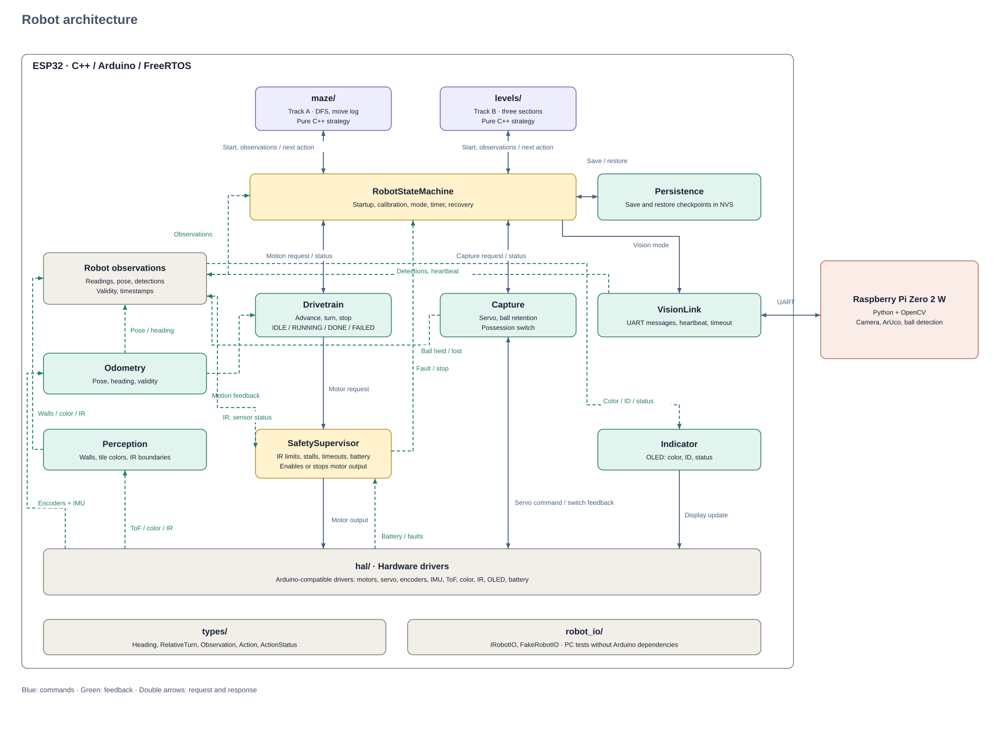

# Software architecture



## Layers

**Strategy** — `maze/` (pista A) and `levels/` (pista B). Pure logic, no
`Arduino.h`. Decides *what* to do; never touches hardware directly.

**Coordination** — `robot/` owns mode, deadline and restart recovery.
`safety/` can cut motor output regardless of strategy.

**Subsystems** — turn intents ("advance one unit") into hardware actions.

**Drivers** — `hal/`, one thin wrapper per chip.

**Foundation** — `types/` (shared vocabulary), `grid/` (the map),
`robot_io/` (the interface between strategy and the world).

## Dependencies of the modules built so far

```
types  ←  grid  ←  robot_io  ←  maze
                 ↖
                   maze_gen   (tests and bench only)
```

Arrows point from a module to what it depends on. Nothing points upward.

## Pista A: how a run works

`MazeSolver` is the runner. Strategies only answer "which way next?".

1. **Start.** The captain places the robot in its corner with the boundary on
   its left. The robot calls that cell (0,0), facing North.
2. **Explore.** Each step: sense walls, record them in the belief map, ask the
   strategy for a direction, turn, look at the tile ahead, advance.
3. **Red is never entered while exploring.** The front color sensor reads the
   next tile; if it is red, the runner refuses the step. Entering red ends the
   round.
4. **Finish.** When the strategy has nothing left, or the deadline is near,
   the runner plans the shortest known route to red with `PathPlanner` and
   drives there.

## Why this split

The maze logic has to run without the robot. Physical debug cycles cost
minutes each and hardware time is limited, so the strategy layer depends on
the `IRobotIO` interface instead of on hardware. The same code runs against
`FakeRobotIO` on a laptop, which is what makes the benchmark possible.

## Known gaps

- `persistence/` is not built. After a lack of progress the robot is power
  cycled and the belief map is lost. Whether the map may be restored mid-round
  is a pending question for the judges.
- The emergency-stop reflex path through `SafetySupervisor` is designed but
  not built.
